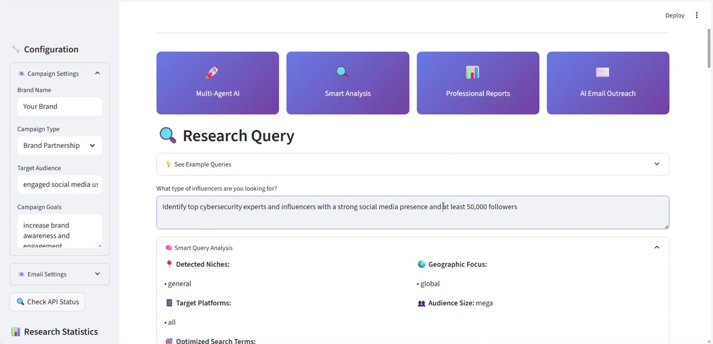
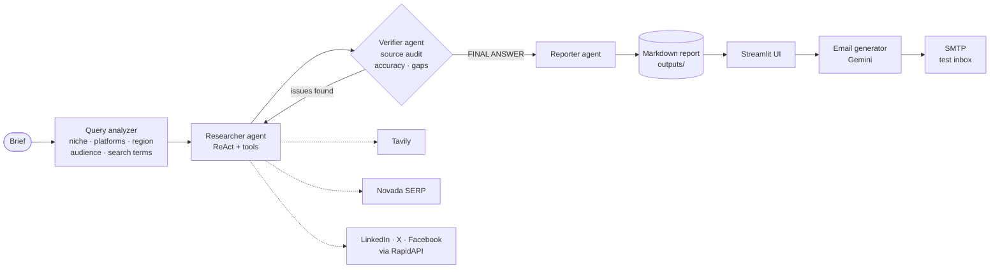

<div align="center">

# Influencer Research Agent

**A multi-agent AI assistant that finds, verifies and contacts influencers from a one-line brief**


<br>

<a href="https://drive.google.com/file/d/1NP73CNs6IY-Tz1qchBkiDaC0kIoaiw3z/view"></a>

<sub><b>▶ Click to watch the 1-minute demo:</b> brief → multi-agent research → report → AI-personalized outreach emails</sub>

</div>

---

## Overview

Building an influencer shortlist by hand takes hours: searching each platform, checking follower counts, digging up a business email, then writing a separate pitch for every creator.

Give this tool a brief such as *"cybersecurity thought leaders with 50K+ followers"* or *"fitness YouTubers in Europe"*. A team of LLM agents then:

1. **Researches** candidates across the web and social APIs,
2. **Verifies** every data point and sends the work back when evidence is missing,
3. **Reports** a structured Markdown dossier (profiles, metrics, contacts, recommendations),
4. **Drafts personalized outreach emails** for each influencer, tailored to your campaign.

---

## Features

| | |
|---|---|
| **Multi-agent workflow** | Three ReAct agents (researcher, verifier, reporter) orchestrated as a LangGraph state machine with a verification feedback loop. |
| **Query understanding** | A rule-based analyzer turns the free-text brief into niche, platforms, region, audience tier, demographics and optimized search terms before research starts. |
| **Multi-source research** | Tavily (advanced web search), Novada (Google SERP), and RapidAPI endpoints for LinkedIn, X/Twitter and Facebook. |
| **Anti-hallucination guardrails** | The agents must cite a tool result for every fact. Unverifiable values are flagged `Gap - needs follow-up`, never invented. |
| **AI outreach** | One-click personalized emails generated from the influencer profile and your campaign settings, with bulk generation. Delivery is sandboxed to a test inbox. |
| **Web app** | Streamlit UI with example briefs, live run status, influencer table with contact actions, Plotly analytics, and export to Markdown, JSON or CSV. |
| **CLI** | Interactive or one-shot terminal mode. Every run saves a timestamped report, including partial results if a run fails. |

---

## How it works



- **Researcher:** a ReAct agent that combines the search and social tools to build a shortlist of 15–20 influencers, with name, handles, platforms, followers, engagement, contact methods, brand deals and red flags.
- **Verifier:** a tool-less agent that audits the draft: are sources cited, are the numbers plausible, which important fields are missing? It either approves the dossier or sends it back to the researcher with a list of issues.
- **Reporter:** writes the final report (executive summary, profile table, detailed dossiers, industry insights, contact strategy, next steps) and saves it to disk with a tool call.
- **Routing** is explicit: each node returns a LangGraph `Command(goto=...)`. A recursion limit stops research–verification loops that never converge.

---

## Getting started

### Prerequisites

- Python 3.11+
- API keys for [Google AI Studio](https://aistudio.google.com/apikey) (Gemini), [Tavily](https://tavily.com), [Novada](https://www.novada.com) and [RapidAPI](https://rapidapi.com)
- *(Optional, for outreach)* an SMTP account. For Gmail, use an [App Password](https://myaccount.google.com/apppasswords).

### Installation

```bash
git clone https://github.com/AhmedAzizBENAYED/influencer-research.git
cd influencer-research

python -m venv .venv
source .venv/bin/activate        # Windows: .venv\Scripts\activate
pip install -r requirements.txt

cp .env.example .env             # then fill in your keys
```

### Run the web app

```bash
streamlit run app.py
```

Open http://localhost:8501, set your campaign details in the sidebar, enter a brief, and click **Start Research**.

### Run from the terminal

```bash
# Interactive mode: shows the query analysis and asks for confirmation
python -m influencer_research

# One-shot mode
python -m influencer_research "find beauty influencers on Instagram and TikTok in North America"
```

Reports are written to `outputs/influencer_report_<timestamp>.md`.

---

## Configuration

| Variable | Required | Description |
|---|---|---|
| `GOOGLE_API_KEY` | ✅ | Gemini API key (research agents and email generation) |
| `TAVILY_API_KEY` | ✅ | Tavily web search |
| `NOVADA_API_KEY` | ✅ | Novada Google SERP scraper |
| `RAPIDAPI_KEY` | ✅ | RapidAPI key with access to the LinkedIn, Twitter and Facebook scrapers |
| `EMAIL_USER` / `EMAIL_PASSWORD` | | SMTP credentials for outreach |
| `SMTP_SERVER` / `SMTP_PORT` | | Defaults to `smtp.gmail.com:587` |
| `OUTREACH_TEST_RECIPIENT` | | Inbox that receives generated emails (defaults to `EMAIL_USER`) |
| `MODEL_NAME` / `EMAIL_MODEL_NAME` | | Override the Gemini models (`gemini-2.5-flash` / `gemini-2.0-flash`) |
| `OUTPUT_DIR` | | Report directory (default `outputs`) |

> **Safe by design:** generated emails are always sent to `OUTREACH_TEST_RECIPIENT`, never directly to an influencer. A human reviews and edits every message before real outreach.

---

## Project structure

```text
.
├── app.py                        # Streamlit web interface
├── influencer_research/
│   ├── __main__.py               # `python -m influencer_research`
│   ├── cli.py                    # Interactive and one-shot terminal interface
│   ├── config.py                 # Environment-driven settings
│   ├── query_analyzer.py         # Brief → niche / platforms / region / search terms
│   ├── prompts.py                # System prompts for the three agents
│   ├── tools.py                  # Tavily, Novada, RapidAPI tools + report writer
│   ├── agents.py                 # Agent factory and graph node logic
│   ├── workflow.py               # LangGraph state machine and report persistence
│   └── outreach.py               # Gemini email generation and SMTP delivery
├── docs/demo.jpg                 # README demo preview
├── .streamlit/config.toml        # UI theme
├── .env.example
└── requirements.txt
```

---

## Tech stack

**LangGraph** (multi-agent orchestration) · **LangChain** (ReAct agents and tools) · **Google Gemini 2.5 Flash** · **Tavily** · **Novada** · **RapidAPI** · **Streamlit** · **Plotly** · **pandas** · **smtplib**

---

## Responsible use

This tool collects **publicly available** professional information. Respect each platform's terms of service and the data protection rules that apply to you (e.g. GDPR) when you store contact details or send outreach. Generated reports are git-ignored because they contain third-party data.

---

## Roadmap

- Structured output (Pydantic) for influencer profiles instead of parsing Markdown tables
- Native Instagram, TikTok and YouTube tools with engagement-rate calculation
- Unit tests for the query analyzer and parsing, plus CI
- Persistent research history and a CRM-style outreach pipeline

---

## Author

**Ahmed Aziz Ben Ayed** · [GitHub](https://github.com/AhmedAzizBENAYED)
